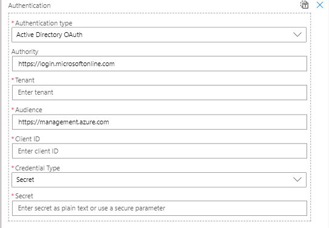

# How to query billing/cost management
This demonstrates how to use a logic app to query billing in both the current subscription and in another subscription in another Azure AD tenant. Much of this centres around how to do authentication of the REST requests to the Azure billing APIs.

## Microsoft documentation
These query examples centre around the cost management part of the APIs, though the process is similar for the other billing-related APIs.

[Cost Management Query Usage](https://docs.microsoft.com/en-us/rest/api/cost-management/query/usage "Azure Cost management")

## REST query
A query is an HTTP REST API call:

```
POST  https://management.azure.com/subscriptions/{{targetSubscriptionId}}/providers/Microsoft.CostManagement/query?api-version=2019-11-01
Content-Type: application/json
Authorization: Bearer {{accessToken}}

{
  "dataset": {
    "aggregation": {
      "totalCost": {
        "function": "Sum",
        "name": "PreTaxCost"
      }
    },
    "granularity": "None",
    "grouping": [
      {
        "name": "ResourceGroup",
        "type": "Dimension"
      }
    ]
  },
  "timeframe": "TheLastMonth",
  "type": "Usage"
}
```
In the code above, a POST is made to cost management API to get a resource group by resource group summary of costs (this is defined in the body of the POST request). The target subscription ID forms part of the URL path. But in order to do this we need an access token.

## Getting the access token
In order to get an access token, there must be an Azure AD app registration in the Azure AD tenant of the target subscription. This app registration must also have the role of "Billing Reader". If you want to query multiple subscriptions under the same Azure AD tenant, then you need to make sure that the billing reader role is set for each of these subscriptions for that app registration.


In the above diagram, the subscription has been selected in the portal and via the IAM menu, the role for the AD application is added to that subscription.

This access token, then will have a clientId and secret and these must be used in the request to get an access token. So the 4 parameters needed for this call are:
1. ClientId
2. Secret
3. The tenantId of the Azure AD tenant
4. The audience - in this case, this is *https://managment.azure.com* - which is the domain of the cost management request.

```
POST https://login.microsoftonline.com/{{tentantid}}/oauth2/token
Content-Type: application/x-www-form-urlencoded

grant_type=client_credentials&client_id={{clientid}}&resource={{audience}}&client_secret={{secret}}

```

## Trying out the REST requests
The pair of REST queries may be executed in a REST client to firstly get the access token and then use this access token to call the cost management API.

Visual Studio Code has a third-party extension called *REST Client* https://github.com/Huachao/vscode-restclient which is invaluable in debugging REST requests to services. It's really simple to use, but also powerful. You can paramaterise requests and then use the response from one request as part of the following one. In this case the call to get the access token provides this value for the second call to cost managment API.

[REST requests for cost managment](billing-blank.http "Azure Cost management")


## Logic Apps
It can often be useful to automate the process of doing cost management or billing queries and logic apps are one such vehicle. Logic apps have an HTTP action that can easily make HTTP requests.


As can be seen from the above screenshot, this is exactly the same type of billing query from the REST requests, above.

The next most important thing is how to get the access token. You could, of course, have another HTTP request to get the access token, but the HTTP Action provides some more automated approaches to getting the access token. 


Two of the more interesting of these are:
1. Managed identity
2. Active Directory OAuth

The former is most useful and easiest if the HTTP needs to authenticate against the current AD tenant. For this to work, you need to:
1. Enable managed identity for the logic app
2. Find the app registration that is created as part of step one and add the "Billing Reader" role to it

For *Active Directory OAuth*, there needs to be more configuration - but exactly the same set of values that the REST requests need.



In the above, I have prefilled in the authority and audience with values that are correct for cost management and billing requests. All that is needed is the AD tenant ID, the clientId and secret.

# Summary
Cost management and billing queries can easily be done through REST requests. Logic apps using the HTTP action have a more streamlined way to authenticate these requests. You can choose to use either managed identities for queries under the same AD tenant or to use OAuth for remote AD tenants. For both of these an AD app registration is needed and this app registration needs to have the *billing reader* role for all of the subscriptions you want to query.
